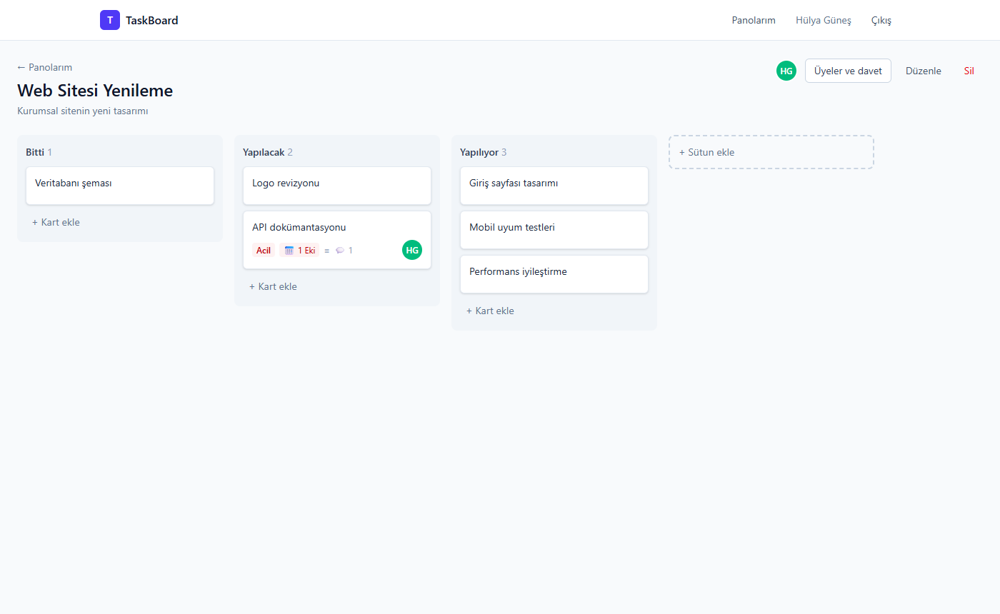
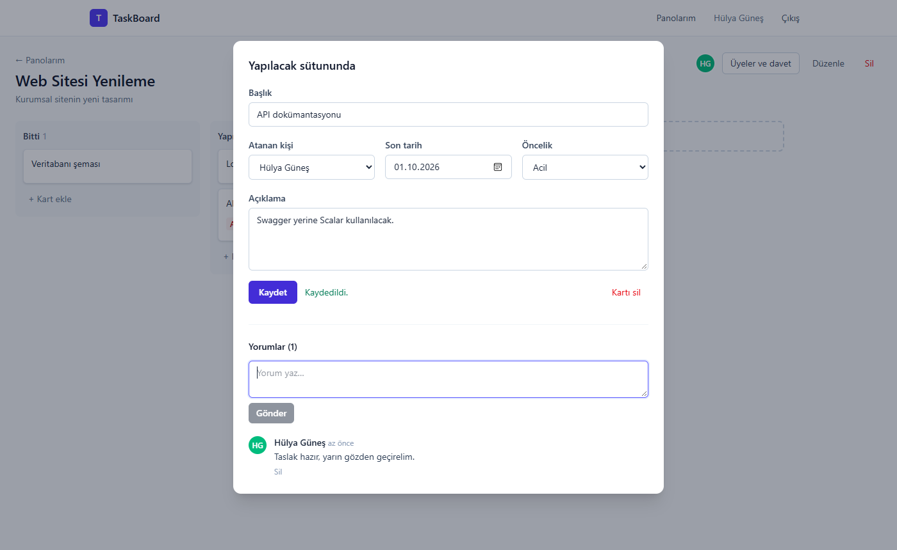
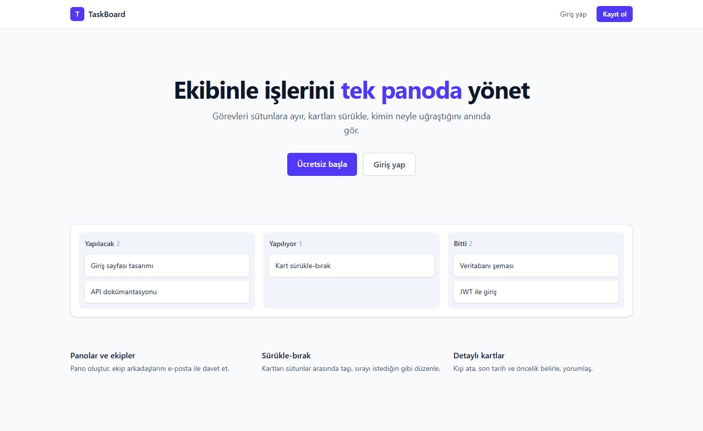

# TaskBoard

Ekipler için Kanban tarzı görev yönetimi uygulaması. Pano oluştur, ekip arkadaşlarını e-posta ile davet et, kartları sütunlar arasında sürükle-bırak ile taşı; kartlara kişi, son tarih ve öncelik ata, yorumlaş.

**Backend:** ASP.NET Core 10 · Clean Architecture · EF Core · PostgreSQL · JWT
**Frontend:** React 19 · TypeScript · Vite · Tailwind CSS · dnd-kit



| Kart detayı | Ana sayfa |
|---|---|
|  |  |

## Özellikler

- **Kimlik doğrulama:** Kayıt / giriş, kısa ömürlü JWT access token + httpOnly cookie'de refresh token, token rotation ve çalıntı token tespiti
- **Panolar ve roller:** Pano sahibi (Owner) ve üye (Member) rolleri; düzenleme, silme ve davet sahibe özel
- **E-posta ile davet:** Tek kullanımlık, süreli davet linki; sadece davet edilen e-postanın sahibi kabul edebilir
- **Sütunlar ve kartlar:** Oluşturma, düzenleme, silme; sürükle-bırak ile kart ve sütun taşıma (fare ve klavye)
- **Kart detayı:** Kişi atama, son tarih (geçmişse kırmızı), öncelik, açıklama, yorumlar

## Mimari

```
TaskBoard/
├── src/
│   ├── TaskBoard.Domain/          → Entity'ler ve enum'lar. Hiçbir şeye bağımlı değil.
│   ├── TaskBoard.Application/     → İş kuralları (servisler), DTO'lar, arayüzler (IAppDbContext, IEmailService…)
│   ├── TaskBoard.Infrastructure/  → EF Core + PostgreSQL, JWT üretimi, şifre hash'leme, e-posta
│   └── TaskBoard.API/             → Controller'lar, JWT doğrulama, hata yönetimi (ProblemDetails)
├── tests/TaskBoard.Tests/         → xUnit
├── client/                        → React + TypeScript (Vite)
└── docker-compose.yml             → PostgreSQL
```

Bağımlılık yönü içe doğrudur: `API → Infrastructure → Application → Domain`. Application katmanı veritabanını, mail sağlayıcısını veya JWT kütüphanesini bilmez; sadece arayüzlerini kullanır.

### Veritabanı

```
User ──< BoardMember >── Board ──< Column ──< Card ──< Comment
                           │                   └── Assignee → User
                           ├──< BoardInvitation
                           └──< ActivityLog
```

`BoardMember` kullanıcı ile panoyu bağlayan ara tablodur ve rol burada tutulur: aynı kişi bir panoda sahip, diğerinde üye olabilir.

## Teknik kararlar

### Sürükle-bırak sıralaması: kesirli sıra numarası
Kartların sırası `double Position` ile tutulur. Bir kart iki kartın arasına bırakılınca yeni sıra numarası komşuların ortalamasıdır (`1` ile `2` arası → `1.5`). Böylece taşıma işlemi, sütundaki diğer kartları güncellemeden **tek bir UPDATE** ile biter.

Aynı aralığa defalarca ekleme yapılırsa `double` hassasiyeti tükenir. Aralık `1e-6`'nın altına düşünce sütun `1, 2, 3…` diye yeniden numaralandırılır (rebalance). Bu nadir olur; normal kullanımda maliyet hep tek satırdır. Bkz. [`Positioning.cs`](src/TaskBoard.Application/Common/Positioning.cs) ve testleri.

İstemci sıra numarası göndermez, sadece "şu sütunun şu sırasına" der (`{ columnId, index }`); hesaplamayı sunucu yapar.

### Token yönetimi
- **Access token** 15 dakikalık JWT'dir ve React'te sadece bellekte tutulur (localStorage'a yazılmaz).
- **Refresh token** 7 günlüktür, `httpOnly` + `Secure` + `SameSite=Strict` cookie'de durur; JavaScript okuyamadığı için XSS ile çalınamaz.
- **Rotation:** Her yenilemede eski token iptal edilip yenisi verilir. İptal edilmiş bir token tekrar kullanılırsa token çalınmış sayılır ve kullanıcının tüm oturumları kapatılır.
- Veritabanında token'ların kendisi değil SHA-256 hash'leri tutulur; şifreler ise PBKDF2 ile hash'lenir.

### Yetkilendirme
- Panonun üyesi olmayan kullanıcıya **404** döner, 403 değil: panonun var olduğu bile sızmaz.
- Tüm pano/sütun/kart/yorum işlemleri tek bir yardımcıdan geçer: [`BoardAuthorization.cs`](src/TaskBoard.Application/Common/BoardAuthorization.cs).

### Diğer
- **Hata yönetimi:** Servisler `NotFoundException`, `ForbiddenException` gibi hatalar fırlatır; tek bir `IExceptionHandler` bunları RFC 9457 ProblemDetails yanıtlarına çevirir. Controller'larda try/catch yok.
- **Sorgular:** Listeler `Select` projeksiyonu ile çekilir (sadece gereken kolonlar, sayımlar SQL'de `COUNT`). İç içe koleksiyonlar split query ile yüklenir.
- **Silme:** Pano silinince sütunlar, kartlar, yorumlar ve davetler veritabanındaki `ON DELETE CASCADE` ile tek sorguda gider.

## Kurulum

Gereksinimler: .NET 10 SDK, Node.js 22+, Docker Desktop

```bash
# 1. PostgreSQL'i başlat
docker compose up -d

# 2. Veritabanı şemasını oluştur
dotnet tool install -g dotnet-ef   # bir kere
dotnet ef database update -p src/TaskBoard.Infrastructure -s src/TaskBoard.API

# 3. API'yi çalıştır → http://localhost:5009
dotnet run --project src/TaskBoard.API

# 4. Ayrı bir terminalde arayüzü çalıştır → http://localhost:5173
cd client
npm install
npm run dev
```

API dokümantasyonu (geliştirme ortamında): http://localhost:5009/scalar

**Davet e-postaları:** Geliştirme ortamında mail gönderilmez; davet linki API'nin terminal çıktısına yazılır. Başka bir kullanıcıyla denemek için linki gizli pencerede açabilirsin.

### Testler

```bash
dotnet test
```

## API

| Metot | Yol | Açıklama |
|---|---|---|
| POST | `/api/auth/register` · `/login` · `/refresh` · `/logout` | Kimlik doğrulama |
| GET | `/api/auth/me` | Giriş yapan kullanıcı |
| GET / POST | `/api/boards` | Panolarım / pano oluştur |
| GET / PUT / DELETE | `/api/boards/{id}` | Pano detayı (sütunlar ve kartlarla) / güncelle / sil |
| DELETE | `/api/boards/{id}/members/{userId}` | Üye çıkar ya da panodan ayrıl |
| GET / POST | `/api/boards/{id}/invitations` | Bekleyen davetler / davet gönder |
| DELETE | `/api/boards/{id}/invitations/{invitationId}` | Daveti iptal et |
| GET | `/api/invitations/{token}` | Davet önizleme (giriş gerekmez) |
| POST | `/api/invitations/{token}/accept` · `/decline` | Daveti kabul et / reddet |
| POST | `/api/boards/{id}/columns` | Sütun ekle |
| PUT / DELETE | `/api/columns/{id}` | Sütunu yeniden adlandır / sil |
| PUT | `/api/columns/{id}/move` | Sütunu taşı |
| POST | `/api/columns/{id}/cards` | Kart ekle |
| GET / PUT / DELETE | `/api/cards/{id}` | Kart detayı / güncelle / sil |
| PUT | `/api/cards/{id}/move` | Kartı taşı (`{ columnId, index }`) |
| POST | `/api/cards/{id}/comments` | Yorum ekle |
| DELETE | `/api/comments/{id}` | Yorumu sil (yazan ya da pano sahibi) |

## Yol haritası

- [x] **1. Aşama:** Kimlik doğrulama, panolar, davetler, sütunlar ve kartlar, sürükle-bırak, kart detayı ve yorumlar
- [ ] SignalR ile canlı güncelleme (kart taşıma, yeni yorum, "şu an panoda" göstergesi)
- [ ] Pano aktivite geçmişi
- [ ] Hangfire ile son tarih hatırlatma ve günlük özet maili (gerçek SMTP)
- [ ] Redis ile pano verisini cache'leme
- [ ] Docker Compose ile tüm sistem, GitHub Actions ile CI
