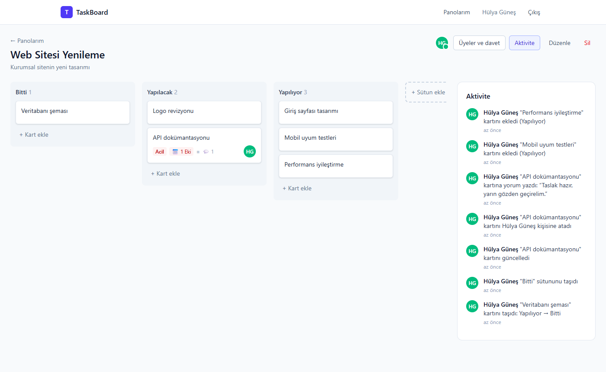

# TaskBoard

[](https://github.com/hlygns/TaskBoard/actions/workflows/ci.yml)

Ekipler için Kanban tarzı görev yönetimi uygulaması. Pano oluştur, ekip arkadaşlarını e-posta ile davet et, kartları sütunlar arasında sürükle-bırak ile taşı; kartlara kişi, son tarih ve öncelik ata, yorumlaş.

**Backend:** ASP.NET Core 10 · Clean Architecture · EF Core · PostgreSQL · JWT · SignalR · Hangfire · Redis
**Frontend:** React 19 · TypeScript · Vite · Tailwind CSS · dnd-kit
**Altyapı:** Docker Compose · nginx · GitHub Actions · xUnit + Testcontainers


| Kart detayı | Aktivite geçmişi |
|---|---|
|  |  |

## Özellikler

- **Kimlik doğrulama:** Kayıt / giriş, kısa ömürlü JWT access token + httpOnly cookie'de refresh token, token rotation ve çalıntı token tespiti
- **Panolar ve roller:** Pano sahibi (Owner) ve üye (Member) rolleri; düzenleme, silme ve davet sahibe özel
- **E-posta ile davet:** Tek kullanımlık, süreli davet linki; sadece davet edilen e-postanın sahibi kabul edebilir
- **Sütunlar ve kartlar:** Oluşturma, düzenleme, silme; sürükle-bırak ile kart ve sütun taşıma (fare ve klavye)
- **Kart detayı:** Kişi atama, son tarih (geçmişse kırmızı), öncelik, açıklama, yorumlar
- **Canlı güncelleme (SignalR):** Başkasının taşıdığı kart, eklediği yorum vb. sayfa yenilemeden görünür; "Ayşe bir kartı taşıdı" bildirimi ve panoda o an kimlerin olduğu (yeşil nokta)
- **Aktivite geçmişi:** "Hülya 'Logo' kartını taşıdı: Yapılacak → Bitti – 10 dk önce"; canlı güncellenir, kart silinse bile kaydı kalır
- **E-posta bildirimleri (Hangfire):** Davet maili, son tarihi yaklaşan kartlar için hatırlatma, her sabah günlük özet
- **Redis:** Pano verisi cache'i; SignalR ve "şu an panoda" bilgisi birden fazla API sunucusunda çalışır

## Mimari

```
TaskBoard/
├── src/
│   ├── TaskBoard.Domain/          → Entity'ler ve enum'lar. Hiçbir şeye bağımlı değil.
│   ├── TaskBoard.Application/     → İş kuralları (servisler), DTO'lar, arayüzler (IAppDbContext, IEmailService…)
│   ├── TaskBoard.Infrastructure/  → EF Core + PostgreSQL, JWT, şifre hash'leme, e-posta (MailKit), Hangfire, Redis cache
│   └── TaskBoard.API/             → Controller'lar, SignalR hub, JWT doğrulama, hata yönetimi (ProblemDetails)
├── tests/TaskBoard.Tests/         → xUnit: birim testleri + Testcontainers ile entegrasyon testleri
├── client/                        → React + TypeScript (Vite); Dockerfile + nginx.conf
├── .github/workflows/ci.yml       → GitHub Actions
└── docker-compose.yml             → PostgreSQL, Redis, Mailpit (+ "app" profilinde api ve client)
```

Bağımlılık yönü içe doğrudur: `API → Infrastructure → Application → Domain`. Application katmanı veritabanını, mail sağlayıcısını veya JWT kütüphanesini bilmez; sadece arayüzlerini kullanır.

### Veritabanı

```
User ──< BoardMember >── Board ──< Column ──< Card ──< Comment
                           │                   └── Assignee → User
                           ├──< BoardInvitation
                           └──< ActivityLog
```

`BoardMember` kullanıcı ile panoyu bağlayan ara tablodur ve rol burada tutulur: aynı kişi bir panoda sahip, diğerinde üye olabilir.

## Teknik kararlar

### Sürükle-bırak sıralaması: kesirli sıra numarası
Kartların sırası `double Position` ile tutulur. Bir kart iki kartın arasına bırakılınca yeni sıra numarası komşuların ortalamasıdır (`1` ile `2` arası → `1.5`). Böylece taşıma işlemi, sütundaki diğer kartları güncellemeden **tek bir UPDATE** ile biter.

Aynı aralığa defalarca ekleme yapılırsa `double` hassasiyeti tükenir. Aralık `1e-6`'nın altına düşünce sütun `1, 2, 3…` diye yeniden numaralandırılır (rebalance). Bu nadir olur; normal kullanımda maliyet hep tek satırdır. Bkz. [`Positioning.cs`](src/TaskBoard.Application/Common/Positioning.cs) ve testleri.

İstemci sıra numarası göndermez, sadece "şu sütunun şu sırasına" der (`{ columnId, index }`); hesaplamayı sunucu yapar.

### Token yönetimi
- **Access token** 15 dakikalık JWT'dir ve React'te sadece bellekte tutulur (localStorage'a yazılmaz).
- **Refresh token** 7 günlüktür, `httpOnly` + `Secure` + `SameSite=Strict` cookie'de durur; JavaScript okuyamadığı için XSS ile çalınamaz.
- **Rotation:** Her yenilemede eski token iptal edilip yenisi verilir. İptal edilmiş bir token tekrar kullanılırsa token çalınmış sayılır ve kullanıcının tüm oturumları kapatılır.
- Veritabanında token'ların kendisi değil SHA-256 hash'leri tutulur; şifreler ise PBKDF2 ile hash'lenir.

### Yetkilendirme
- Panonun üyesi olmayan kullanıcıya **404** döner, 403 değil: panonun var olduğu bile sızmaz.
- Tüm pano/sütun/kart/yorum işlemleri tek bir yardımcıdan geçer: [`BoardAuthorization.cs`](src/TaskBoard.Application/Common/BoardAuthorization.cs).

### Canlı güncelleme (SignalR)
- Pano sayfasını açan istemci `/hubs/board` hub'ına bağlanır ve o panonun **grubuna** katılır (`JoinBoard`). Gruba sadece panonun üyeleri katılabilir.
- Application katmanı SignalR'ı bilmez: servisler değişikliği kaydettikten sonra `IBoardNotifier`'a "bu panoda şu oldu" der; SignalR uygulaması API katmanındadır.
- Olay mesajı küçüktür (`CardMoved`, kart ve sütun kimliği, yapan kişi). İstemci güncel veriyi kendi yetkisiyle API'den çeker; böylece yetki kontrolü tek yerde kalır ve mesajlardan veri sızmaz.
- Değişikliği yapan istemci, isteğe SignalR bağlantı kimliğini `X-Connection-Id` başlığıyla ekler; sunucu olayı ona geri göndermez (ekranını zaten iyimser olarak güncelledi).
- Sürükleme sırasında başkasının değişikliği gelirse uygulanmaz, bırakınca pano tazelenir; böylece tutulan kart kaymaz.
- Tarayıcı WebSocket isteğine `Authorization` başlığı ekleyemediği için JWT, sadece `/hubs` yolunda `access_token` sorgu parametresinden okunur.

### Aktivite geçmişi
- Aktivite kaydı, asıl değişiklikle **aynı `SaveChanges`'ta (aynı transaction'da)** yazılır: "kart taşındı ama kaydı yok" ya da tersi olamaz. Bu yüzden kart/sütun silme `ExecuteDelete` yerine `Remove` + `SaveChanges` ile yapılır.
- Kayıt, karta foreign key ile bağlanmaz; o anki adlar (kart başlığı, sütun adları) PostgreSQL `jsonb` kolonunda **anlık kopya** olarak saklanır. Kart silinse ya da adı değişse bile geçmiş doğru kalır.
- Cümleyi istemci kurar (`{ type: "CardMoved", data: { cardTitle, fromColumn, toColumn } }`); dil/çeviri arayüzde kalır.
- Sayfalama **keyset** ile yapılır (`?before=<createdAt>`): `OFFSET`'in aksine derin sayfalarda da `(board_id, created_at)` index'inden doğrudan okunur ve yeni kayıt eklenince sayfalar kaymaz.
- Kendi değişikliklerimiz için sunucudan canlı olay gelmediğinden, API istemcisi başarılı her değişiklik isteğinden sonra uygulama içinde bir sinyal yayar; aktivite paneli bunu dinler.

### Arka plan işleri (Hangfire) ve e-posta
- Mailler HTTP isteği içinde gönderilmez; **Hangfire kuyruğuna** atılır. İstek SMTP'yi beklemez (davet isteği ~0,2 sn), SMTP geçici olarak çökerse Hangfire otomatik tekrar dener. İşler PostgreSQL'de (`hangfire` şeması) saklandığı için API yeniden başlasa da kaybolmaz.
- Düzenli işler (Europe/Istanbul saatiyle):

  | İş | Zaman | Ne yapar |
  |---|---|---|
  | `due-date-reminders` | Saatte bir | Son tarihi bugün/yarın olan, atanmış kartlar için kişi başına tek hatırlatma maili |
  | `daily-digest` | Her gün 08:00 | Gecikmiş ve 3 gün içinde son tarihi olan kartlar + son 24 saatteki hareket sayısı |
  | `activity-cleanup` | Pazar 03:00 | 180 günden eski aktivite kayıtlarını siler |

- Aynı karta iki kez hatırlatma gitmemesi için `Card.DueReminderSentAt` tutulur; son tarih değişince sıfırlanır. İş önce maili kuyruğa alır, sonra kartı işaretler: arada çökerse en kötü ihtimalle mail iki kez gider, hiç gitmemesinden iyidir (at-least-once).
- İş mantığı (`DueDateReminderJob` vb.) Application katmanındadır ve Hangfire'ı bilmez; zaman `TimeProvider` ile alınır (test edilebilir). Hangfire sadece zamanlar.
- Mail şablonlarındaki tüm kullanıcı metinleri HTML-encode edilir. "Bitti" adlı sütunlardaki kartlar tamamlanmış sayılır ve maillere girmez.

### Redis
- **Pano cache'i:** Pano detayı (sütunlar + kart özetleri) Redis'te 10 dk tutulur; ilk açılış ~23 ms, cache'ten ~6 ms. Yetki kontrolü her zaman veritabanından yapılır; cache'teki kopya herkes için aynıdır, sadece `myRole` isteği yapana göre doldurulur.
- **Cache temizliği decorator ile:** Panoyu değiştiren her işlem zaten `IBoardNotifier`'a haber verdiği için `CacheInvalidatingBoardNotifier` onu sarar: önce cache'i siler, **sonra** SignalR olayını gönderir. Tersi olsaydı olayı alan istemci eski cache'i okuyabilirdi. Böylece hiçbir servis cache'i silmeyi unutamaz.
- **SignalR backplane:** API birden fazla sunucuda çalışınca bir sunucudaki olay Redis pub/sub ile diğer sunuculara bağlı istemcilere ulaşır.
- **"Şu an panoda" bilgisi** Redis hash/set'lerinde tutulur (`presence:board:{id}`, `presence:conn:{id}`); sunucu aniden kapanırsa kayıtlar TTL ile kendiliğinden silinir. İki API kopyası (5019/5020) ve farklı sunuculara bağlı iki kullanıcıyla test edilmiştir.
- **Redis olmadan da çalışır:** Bağlantı ayarı yoksa bellek içi uygulamalar kullanılır; Redis çökerse cache atlanıp veritabanına gidilir.

### Diğer
- **Hata yönetimi:** Servisler `NotFoundException`, `ForbiddenException` gibi hatalar fırlatır; tek bir `IExceptionHandler` bunları RFC 9457 ProblemDetails yanıtlarına çevirir. Controller'larda try/catch yok.
- **Sorgular:** Listeler `Select` projeksiyonu ile çekilir (sadece gereken kolonlar, sayımlar SQL'de `COUNT`). İç içe koleksiyonlar split query ile yüklenir.
- **Silme:** Pano silinince sütunlar, kartlar, yorumlar, davetler ve aktiviteler veritabanındaki `ON DELETE CASCADE` ile tek sorguda gider.

## Kurulum

### Seçenek 1: Tek komutla her şey Docker'da

Gereksinim: Docker Desktop

```bash
docker compose --profile app up -d --build
```

Uygulama **http://localhost:8080** adresinde açılır; maillere **http://localhost:8025** (Mailpit) adresinden bakılır. Veritabanı şeması API açılırken otomatik kurulur.

| Container | Ne |
|---|---|
| `client` | nginx: React uygulamasını sunar, `/api` ve `/hubs` (WebSocket) isteklerini API'ye iletir |
| `api` | ASP.NET Core API + Hangfire işleri |
| `db` · `redis` · `mailpit` | PostgreSQL · Redis · sahte posta kutusu |

Durdurmak için: `docker compose --profile app down` (veriler `pgdata` volume'unda kalır).

### Seçenek 2: Geliştirme ortamı

Gereksinimler: .NET 10 SDK, Node.js 22+, Docker Desktop

```bash
# 1. PostgreSQL, Redis ve Mailpit'i başlat
docker compose up -d

# 2. Veritabanı şemasını oluştur
dotnet tool install -g dotnet-ef   # bir kere
dotnet ef database update -p src/TaskBoard.Infrastructure -s src/TaskBoard.API

# 3. API'yi çalıştır → http://localhost:5009
dotnet run --project src/TaskBoard.API

# 4. Ayrı bir terminalde arayüzü çalıştır → http://localhost:5173
cd client
npm install
npm run dev
```

Geliştirme ortamında:

| Adres | Ne |
|---|---|
| http://localhost:5173 | Uygulama |
| http://localhost:8025 | **Mailpit**: uygulamanın gönderdiği tüm mailler burada görünür (gerçek kimseye mail gitmez) |
| http://localhost:5009/hangfire | Hangfire paneli: kuyruktaki ve düzenli işler, "Şimdi tetikle" ile hemen çalıştırma |
| http://localhost:5009/scalar | API dokümantasyonu |

Başka bir kullanıcıyla denemek için: panodan davet gönder → Mailpit'teki maildeki linki gizli pencerede aç.

### Testler

```bash
dotnet test        # Docker çalışıyor olmalı
```

- **Birim testleri:** Kesirli sıralama mantığı (`Positioning`), rebalance dahil.
- **Entegrasyon testleri:** Gerçek API bellek içinde (`WebApplicationFactory`) çalışır; **Testcontainers** her çalıştırmada Docker'da sıfırdan bir PostgreSQL açar ve migration'ları uygular. Mail yerine mailleri kaydeden sahte bir servis kullanılır.
  - Kimlik doğrulama: refresh token rotation ve çalıntı token tespiti, aynı hata mesajı (user enumeration), büyük/küçük harf duyarsız e-posta
  - Yetki: yabancıya 404, üyeye 403, sahip panodan ayrılamaz, çıkarılan üyenin atamaları kalkar
  - Davet: sadece davet edilen e-posta kabul edebilir, tek kullanımlık, girişsiz önizleme
  - Kartlar: sütunlar arası/içi taşıma kalıcılığı, başka panoya taşıma engeli, aktivite geçmişi (kart silinince de adı kalır), keyset sayfalama
  - Hatırlatma işi: sadece yakın tarihli, atanmış ve bitmemiş kartlar; ikinci çalışmada tekrar mail yok

### CI (GitHub Actions)

Her push ve pull request'te: **backend** (Release derleme + tüm testler, Testcontainers dahil) · **frontend** (lint + TypeScript + build) · ikisi geçerse **Docker** image'larının derlenmesi.

## API

| Metot | Yol | Açıklama |
|---|---|---|
| POST | `/api/auth/register` · `/login` · `/refresh` · `/logout` | Kimlik doğrulama |
| GET | `/api/auth/me` | Giriş yapan kullanıcı |
| GET / POST | `/api/boards` | Panolarım / pano oluştur |
| GET / PUT / DELETE | `/api/boards/{id}` | Pano detayı (sütunlar ve kartlarla) / güncelle / sil |
| DELETE | `/api/boards/{id}/members/{userId}` | Üye çıkar ya da panodan ayrıl |
| GET / POST | `/api/boards/{id}/invitations` | Bekleyen davetler / davet gönder |
| DELETE | `/api/boards/{id}/invitations/{invitationId}` | Daveti iptal et |
| GET | `/api/invitations/{token}` | Davet önizleme (giriş gerekmez) |
| POST | `/api/invitations/{token}/accept` · `/decline` | Daveti kabul et / reddet |
| POST | `/api/boards/{id}/columns` | Sütun ekle |
| PUT / DELETE | `/api/columns/{id}` | Sütunu yeniden adlandır / sil |
| PUT | `/api/columns/{id}/move` | Sütunu taşı |
| POST | `/api/columns/{id}/cards` | Kart ekle |
| GET / PUT / DELETE | `/api/cards/{id}` | Kart detayı / güncelle / sil |
| PUT | `/api/cards/{id}/move` | Kartı taşı (`{ columnId, index }`) |
| POST | `/api/cards/{id}/comments` | Yorum ekle |
| DELETE | `/api/comments/{id}` | Yorumu sil (yazan ya da pano sahibi) |
| GET | `/api/boards/{id}/activities?before=&limit=` | Aktivite geçmişi (keyset sayfalama) |
| WS | `/hubs/board` | SignalR: `JoinBoard`, `LeaveBoard`; olaylar `BoardEvent`, `PresenceChanged` |

## Yol haritası

- [x] **1. Aşama:** Kimlik doğrulama, panolar, davetler, sütunlar ve kartlar, sürükle-bırak, kart detayı ve yorumlar
- [x] SignalR ile canlı güncelleme (kart taşıma, yeni yorum, "şu an panoda" göstergesi)
- [x] Pano aktivite geçmişi
- [x] Hangfire ile son tarih hatırlatma ve günlük özet maili (gerçek SMTP)
- [x] Redis ile pano cache'i, SignalR backplane ve dağıtık "şu an panoda" bilgisi
- [x] Docker Compose ile tüm sistem, xUnit + Testcontainers entegrasyon testleri, GitHub Actions ile CI
- [ ] (İsteğe bağlı) React Native mobil uygulama
